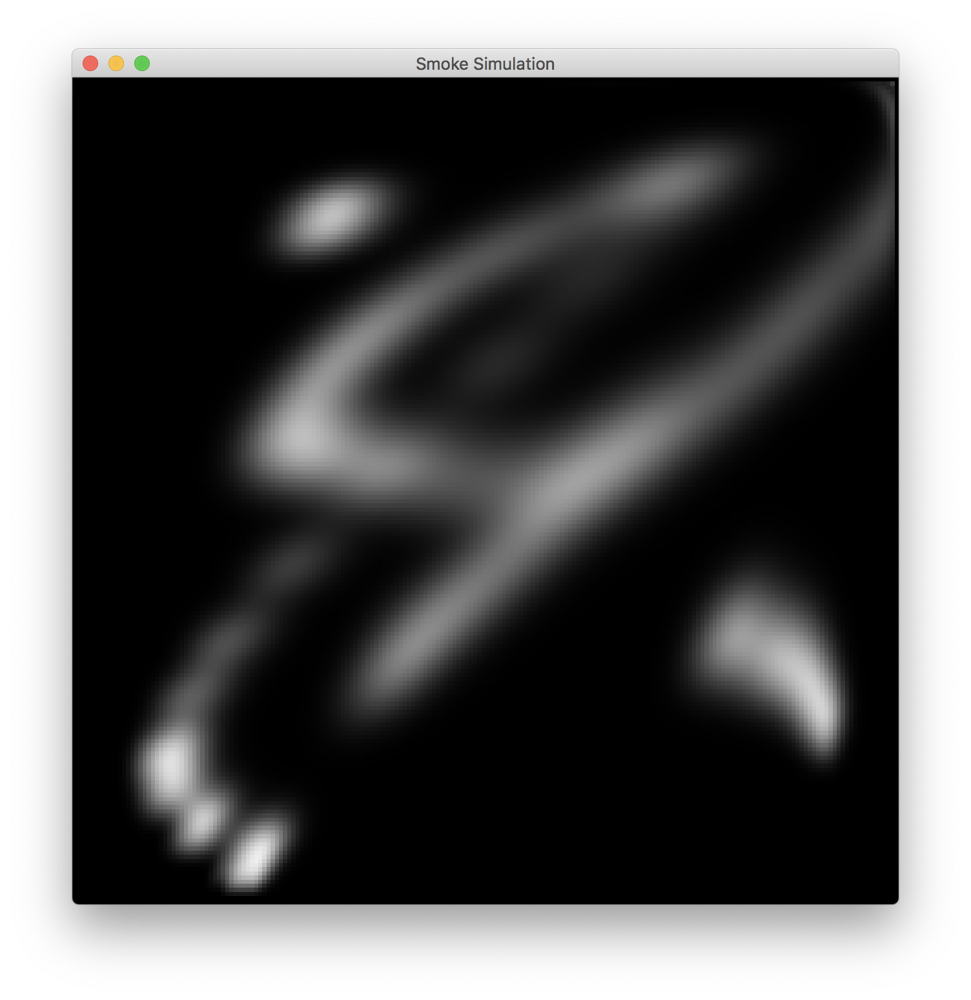

## 
CS 184 Final Project: Smoke Simulation Milestone

### 
Eric Ying, Yuanhao Zhai, Fangzhou Lan

------

### Progression Summary

In a word, currently, we are a little ahead of our planned goals, however, some bugs and edge conditions remain to be solved. 

The functionalities we have accomplished so far include: density advection, velocity advection, viscous diffusion and external forces. For the GUI part, we are able to render a 2D grid to simulate the smoke, we also added mouse input to create smoke.

However, we did consider the interaction between smoke and boundary.

------

### Preliminary Results

We can launch a 2D grid in which the user can create smoke using mouse dragging. We take a simple screenshot to show the result.

------

### Reflection

In our project, the main challenge is to solve simulation equations, however, in our simulation, the processes to solve these equations outweigh the answer, because it is the processes that determine the amount of calculation, which further effect the fluency of our program.

------

### Updated Work Plan

1. In this week, we are going to finish all the simulation part, namely add external force, temperature, take care of edge conditions, improve performance and fix potential bugs.
2. For the next week, we will mainly focus on adding more functionalities to the GUI, like adjust parameters using keyboard, add color to the smoke. What's more, we will   start the final project write-up.