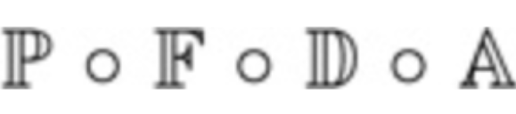
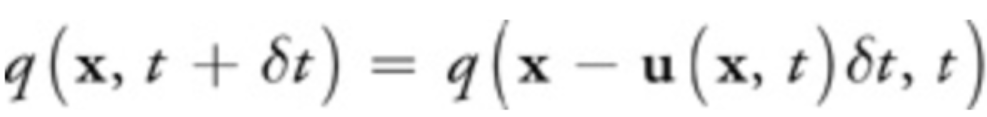
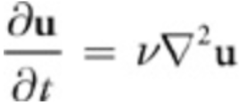
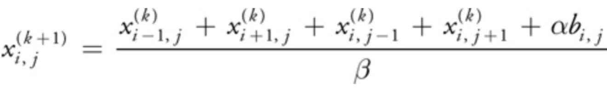
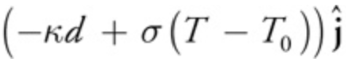

## 
CS 184 Final Project: Smoke Simulation Final Report

### 
Eric Ying, Yuanhao Zhai, Fangzhou Lan

------

## Abstract
We implemented realistic smoke simulation in a 2D grid based environment, and used OpenGL to represent our simulation. Mouse input was caught by callbacks to create smoke and affect the path of the smoke. We integrated nanogui to our project, allowing various adjustable parameters including heat, density, color and so on. OpenMP was added for acceleration of the simulation part, and shader programs in OpenGL for acceleration of the rendering part.

------

## Technical Approach

### Implementation

Pipeline of our implementation.

#### Physical Simulation

##### Order of Operations

<td>
    
</td>

+ For density and temperature , we only advect.
+ For velocity, we first advect, then diffuse, then apply external and buoyant forces, and finally project our velocity field.

##### Advection

<td>
    
    <figcaption>Stam’s method</figcaption>
</td>

+ Advection is movement of certain quantities along the velocity field.
    + In our simulation, we advect smoke density, temperature, and velocity
+ We use reverse advection technique to ensure stability. (**Stam’s method**)
    + For each grid location/cell, we trace its velocity backwards.
    + We linearly interpolate the smoke quantities closest to the position we end up.
    + We set the quantity of the original cell to the interpolated quantity.

+ q is the quantity we want to advect, x is a location in our grid, t is the current time, δt is the duration of a timestep, and u is the velocity field.

##### Diffusion
+ Diffusion occurs when smoke moves from areas of higher concentration to areas of lower concentration.
+ Viscosity is the natural resistance of fluids to flow.
+ We solve the below partial differential equation to determine velocity field after viscous diffusion occurs.
+ We iteratively solve the equation using 
**Jacobi iteration**.

<td>
    
    <figcaption>Diffusion Equation: u is velocity field, v is viscosity term </figcaption>
</td>

##### Jacobi iteration 

<td>
    
</td>

+ The Jacobi iteration technique involves iterating several times.
+ In our simulation, the number of iterations is set default at $16$.
+ For viscous diffusion, the $x$ and $b$ term is the velocity at location $i, j, α$ term is $1/(num\_iter\cdot dt)$, and $\beta$ term is $4 + \alpha$. 
+ For pressure, the $x$ term is the pressure at location $i, j, b$ is the divergence of the velocity field at location $i, j, α$ term is $-(dx)$, and $β$ term is $4$.

##### Buoyancy

<td>
    
</td>

+ Buoyant forces result from smoke traveling from areas of high temperature to lower temperature. Buoyant forces result in the smoke traveling up. 

+ $d$ is the density of smoke, $T$ is the temperature of smoke, To is the ambient temperature, $j$ is a vector pointing up, and $\kappa, \sigma$ are adjustable parameters.

##### Projection
+ The projection step ensures that the velocity field is mass conserving. 
    + Improves stability of the simulation. Ensures that the velocity fields don’t explode or die down.
+ We first calculate the divergence of the velocity field. 
+ We then calculate the pressure at each grid location, using the Jacobi technique.
Finally, we subtract the gradient of the pressure from the vector field.

#### Smoke Generation (Mouse Tracking)
We generate smoke by tracking the clicks and drags of mouse. Callback funtions will catch the cursor movement (static mouse click is specially shandled), setting density and temperature fields correspondingly. To better simulate the emission of smoke, we update the density and temperature fields of all the grids in a certain distance from the mouse. We also adds quadratic fall-off to the emission fields, similar to the definition of irradiance.

Besides, we add HSV color fields to the smoke, which is an intuitive color model. We set `HUE` as a range of value determined by temprature, with the color wheel's select the center of range. We set `Satuaration` to $100.0$, which represents primary colors. We set `Value`, which stands for brightness, to density of smoke naturally. 
+ $HUE = (value\_of\_color\_wheel - (temperature - 50)) % 360$ 
+ $SATURATION = 100$
+ $VALUE = density$

The HSV fields are finally transformed to RGB and displayed on screen. 

#### Rendering

The rendering part can be separated into three stages:

1. Generate the density map and temperature map from simulation.
2. Convert density and temperature map into RGB texture map.
3. Use shader program to map the texture map to screen.

Specifically, for the second step, we create a char array with capacity $3\times W\times H$, where $W$ and $H$ are width and height of the grid, respectively. We first calculate the HSV value of each grid. We then change the HSV fields to RGB fields, and save the RGB color to the array, which is basically a texture map now. After that, we pass the array to fragment shader as a 2D sampler, and render the grid.

#### GUI
We added nanogui to our project from scratch. Widgets we used includes sliders for configuring smoke parameters and a color wheel.

#### Optimizations
We should accelerate simulation part in order to achieve a frequency of more than 60 FPS.

+ Using OpenMP: We configured OpenMP and added `#pragma` of OpenMP before each time-consuming loops of simulation part. We have to make sure that we do not parallel the time steps by accident. Simply by these we get a acceleration of 4-5 times on a 6-core Macbook Pro.

+ Using references and move constructors: We use reference of variables instead of a new copy if possible. Besides, we prefer move constructor of class objects instead of copy constructor to reduce unnecessary copy. 

### Problems and Solutions

1. In rendering part, our first implementation is to render each square of the grid separately, namely each time pass one color to fragment shader and then render a square. This implementation greatly limitted the performance. To tackle this problem, instead of drawing many squares, we only draw one window-size square with texture map of the entire grid. In this manner, we got about 50X speed up for grid size  300 × 300.

2. In the mouse tracking part, at first we update the position only once in a simulation & rendering round, causing obvious stutter and discontinuity in generation of smoke. Then we tried multithread in C++11, which also seemed strange in the generation of smoke. One possible reason is that we could't make a good schedule of the threads easily. At last, we solved it by putting this part to the cursor-movement callback function.

3. About organization of project files, we used lots of extern and global declarations and included many common headers at first, which is problematic when the project size becomes large. We solved it by Singleton Pattern: organizing most of the global variables into static variables of a class.

### Lessons

From this project, we learned how to make realistic physical simulation and writing OpenGL for grid's rendering. Also we got experience on how to organize a relatively large C++ project, as well as integrating libraries like nanogui for GUI and OpenMP for acceleration. 

------

## Results

------

## References

[Chapter 38. Fast Fluid Dynamics Simulation on the GPU](http://developer.download.nvidia.com/books/HTML/gpugems/gpugems_ch38.html)

[Real-Time Fluid Dynamics for Games](http://www.dgp.toronto.edu/people/stam/reality/Research/pdf/GDC03.pdf)

------

### Contributions from team member