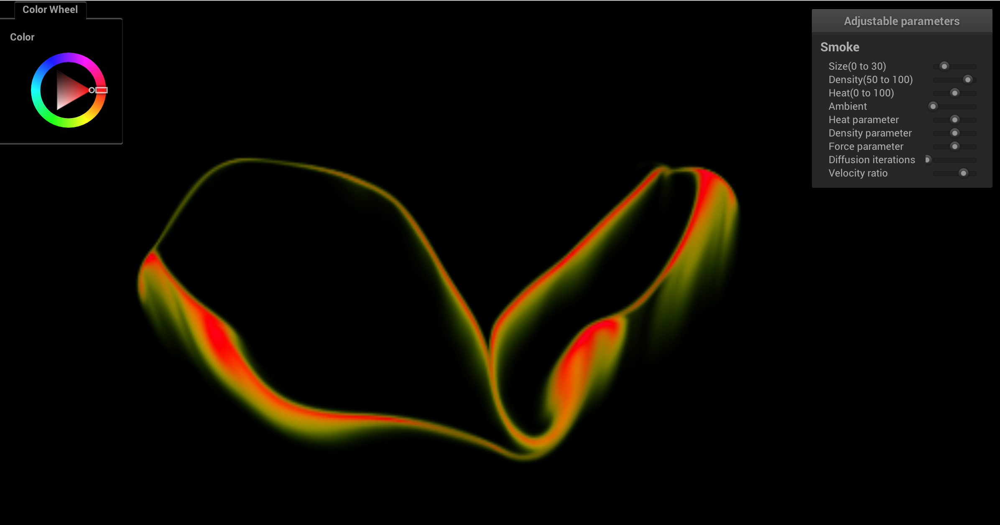
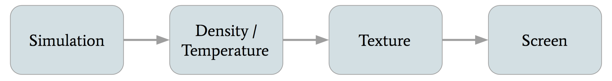
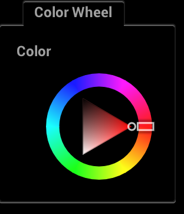
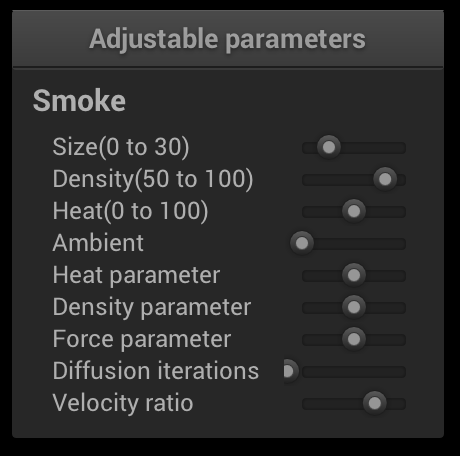

## 
CS 184 Final Project: 2D Grid Based Smoke Simulation Final Report

### 
Eric Ying, Yuanhao Zhai, Fangzhou Lan

------

## Abstract

For our CS184 final project, we implemented realistic smoke simulation in a 2D grid based environment. We used OpenGL to render our simulation live on a window. Mouse input was caught by callbacks to allow users to create smoke and affect the path/initial velocity of the smoke. We also integrated the nanogui library into our project, allowing users to adjust various parameters including heat, density, color and so on. OpenMP was added for acceleration of the simulation part, and shader programs in OpenGL were added for acceleration of the rendering part.

------

## Technical Approach 

### Implementation

Pipeline of our implementation.

We first retrieve the density and temperature each each grid location from our simulation. We convert those into HSV and then into RGB colors for each grid location, depending on the density and temperature. We create a texture from those colors, and finally we display the texture on the screen.

#### Physical Simulation

##### Basic Technical Overview and Order of Operations
$$
\mathbb{P\cdot F\cdot D\cdot A}
$$

For our simulation, we kept track of three quantities: smoke density, temperature, and velocity. The grid, which represented the entire space of the simulation, was split into individual cells. Each cell contained the density, temperature, and velocity of the smoke at that specific location. 

+ For density and temperature, we only advect the quantities.
+ For velocity, we first advect, then diffuse, then apply external and buoyant forces, and finally project our velocity field.

We used <http://developer.download.nvidia.com/books/HTML/gpugems/gpugems_ch38.html> as our primary resource for our simulation equations. We implemented most of the features in the webpage, with the exception of vorticity confinement. 

##### Advection

$$
q(\mathbf{x},t+\delta t)=q(\mathbf{x}-\mathbf{u}(\mathbf{x},t)\delta t, t)
$$

Stam’s method

Advection is movement of certain quantities along the velocity field. Recall that in our simulation, we advect smoke density, temperature, and velocity. It is necessary to advect velocity in order to realistically simulate the flow of the smoke.

We use reverse advection technique to ensure stability. (**Stam’s method**) For each grid location/cell, we trace its velocity backwards. We linearly interpolate the flour smoke quantities closest to the position we end up. We set the quantity of the original cell to the interpolated quantity. The reverse advection technique improves stability in the simulation and makes sure the quantities do not diverge as time goes on.

In the above equation, q is the quantity we want to advect, x is a location in our grid, t is the current time, δt is the duration of a timestep, and u is the velocity field.

##### Diffusion

Diffusion occurs when smoke moves from areas of higher concentration to areas of lower concentration. Viscosity is the natural resistance of fluids to flow. We model viscous diffusion by updating the velocity field to simulate the effects of smoke diffusing outwards. We solve the below partial differential equation to determine the updates to the velocity field. In order to actually solve the equation, we use the **Jacobi iteration** technique.

$$
\frac{\partial \mathbf{u}}{\partial t}=v\nabla^2\mathbf{u}
$$

Diffusion Equation: u is velocity field, v is viscosity term

##### Jacobi iteration 

$$
x^{(k+1)}_{i,j}=\frac{x^{(k)}_{i-1,j} + x^{(k)}_{i+1,j} + x^{(k)}_{i,j-1}+x^{(k)}_{i,j+1}+\alpha b_{i,j}}{\beta}
$$

The Jacobi iteration technique involves iterating several times and continuously updating the values of the grid. In our simulation, the number of iterations was set default at $16$. For viscous diffusion calcualations, the $x$ and $b$ term is the velocity at location $i, j, α$ term is $1/(num\_iter\cdot dt)$, and $\beta$ term is $4 + \alpha$. For pressure calculations, the $x$ term is the pressure at location $i, j, b$ is the divergence of the velocity field at location $i, j, α$ term is $-(dx)$, and $β$ term is $4$. The higher the number of iterations, the more realistic our simulation becomes, but the longer the computation time of the simulation becomes as well.

##### Buoyancy

$$
\left(-\kappa d+\sigma(T-T_0)\right)\hat{\mathbf{j}}
$$

Buoyant and gravitational force

Buoyant forces result from smoke traveling from areas of high temperature to lower temperature. Buoyant forces result in the smoke traveling up. It is the equivalent of hot air rising and cold air falling. We also model a gravitational force on the smoke that pulls the particles down. In the above equation, $d$ is the density of smoke, $T$ is the temperature of smoke, $To$ is the ambient temperature, $j$ is a vector pointing up, and $\kappa, \sigma$ are adjustable parameters. Notice that the gravitational force counteracts the buoyant force, although the buoyant force is usually much higher than the gravitational force.

We also add any external forces in the step. The external forces come from the user created velocity fields. When the user presses m, they can drag and create their own "wind tunnels". In the simulation, all we do is add the input force to the velocities at each grid location, scaled by an external force parameter.

##### Projection
The projection step ensures that the velocity field is mass conserving and the flow incompressible. An incompressible fluid and mass conserving field ensures that the total density of the smoke in the simulation doesn't increase or decrease on its own. It also ensures that the velocity field does not explode or die down. This improves stability of the simulation and makes the simulation that much more realistic. 

We use **Helmholtz–Hodge decomposition** for our projection step. This decomposition states that our velocity can be decomposed into a divergence free field and a gradient field. $u_{field} = u_{div} + u_{grad}$ For our projection step, we first calculate the divergence of the velocity field at each grid location. This involves finding the difference in the $x$ velocity of the left and right cells, adding that to the difference in $y$ velocity in the top and bottom cell, and scaling the result be a factor (0.5). Once we have the divergence, we then calculate the pressure at each grid location using the Jacobi technique as described earlier. Finally, we subtract the gradients of the pressure from the vector field at each grid location. The gradients of the pressure is found by  taking the slope/rate of change of the pressure at each grid location. $\delta p = (p_{right} - p_{left}, p_{up} - p_{bottom})$

Below are the three steps for projection.
1. Find the divergence at each grid location.
2. Find the pressure at each grid location using Jacobi iteration and the divergence.
3. Subtract gradient of pressure from the final velocity field.

#### Smoke Generation (Mouse Tracking)
We generate smoke by tracking the clicks and drags of mouse. Callback funtions are used to catch the cursor movement (static mouse clicks are handled separately), and set density and temperature fields correspondingly. To better simulate the emission of smoke, we update the density and temperature fields of all the grids in a certain distance from the mouse using a falloff equation. We add a quadratic fall-off to the emission fields, similar to the definition of irradiance. This way, smoke further away from the mouse click are less dense and less hot.

Additionally, the dragging of the mouse is tracked for updates to velocity. In the callback function, we update the velocity fields of the cells in the grid that are a certain distance from the mouse, using a weighted average of the previous velocity and the mouse's velocity: 
$mouse\_velocity * \alpha + previous\_velocity * (1 - \alpha)$. Here, mouse_velocity is proportional to direction of mouse, and $\alpha$ is an adjustable parameter in $[0,1]$.

Finally, we add HSV color fields to the smoke, which is an perceptually uniform and intuitive color model. We set `HUE` as a range of value determined by the temprature, and the color wheel is used to select the center the range of values. We set `Satuaration` to $100.0$, which represents primary colors. We set `Value`, which stands for brightness, to the density of the smoke naturally. 
+ $HUE = (value\_of\_color\_wheel - (temperature - 50)) % 360$ 
+ $SATURATION = 100$
+ $VALUE = density$

The HSV color values are finally transformed to RGB and displayed on screen. 

#### Rendering

The rendering part can be separated into three stages:

1. Generate the density map and temperature map from simulation.
2. Convert density and temperature map into RGB texture map.
3. Use shader program to map the texture map to screen.

Specifically, for the second step, we create a char array with capacity $3\times W\times H$, where $W$ and $H$ are width and height of the grid, respectively. We first calculate the HSV value of each grid. We then change the HSV fields to RGB fields, and save the RGB color to the array, which is basically a texture map. After that, we pass the array to fragment shader as a 2D sampler and render the grid.

#### GUI
We added nanogui to our project from scratch. Specifically, we added slider widgets for configuring smoke parameters and a color wheel widget for selecting the color of the smoke. Below is a screenshot of our nanogui elements. 

+ Size controls the size of user created smoke. 
+ Density controls the initial density of the user created smoke. 
+ Heat and ambient control the temperature of the smoke and the environment respectively. 
+ Heat parameter controls how buoyant the smoke is (higher means smoke rises faster). 
+ Density parameter controls how much the density of the smoke affects the gravitational force (higher means smoke falls more likely). 
+ Force parameter controls the magnitude of the external force created by users. 
+ Diffusion iteration controls how many times we iterate for Jacobi iteration (higher means more realistic but slower simulation).
+ Velocity ratio controls how much the dragging of the mouse affects the velocity field.

<td>
    
</td><td>
    
</td>

#### Optimizations
We accelerate the simulation in order to achieve a frequency of more than 60 FPS. To do so, we use the below methods. 

+ Using OpenMP: We configured OpenMP and added `#pragma` headers before each time-consuming loops of simulation part. We made sure to not parallelize the time steps by accident. Just by doing this, we got an acceleration of 4-5 times on a 6-core Macbook Pro.

+ Using references and move constructors: We use reference of variables instead of a new copies if possible. Besides, we prefer move constructor of class objects instead of copy constructor to reduce unnecessary copying. 

### Problems and Solutions

1. In the rendering part, our first implementation was to render each square of the grid separately, namely each time passing one color to fragment shader and then rendering a square. This implementation greatly limited the performance of our simulation. To tackle this problem, instead of drawing each individual squares separately, we only drew one window-size square with texture map of the entire grid. In this manner, we got about 50X speed up for grid size  300 × 300.

2. In the mouse tracking part, at first we updated the position only once in a simulation & rendering round, causing obvious stutters and discontinuities in the generation of smoke. Then we tried multithreading in C++11, which also seemed strange in the generation of smoke. One possible reason was that we could not make a good schedule of the threads easily. At last, we solved this problem by putting the mouse tracking part of the code to the cursor-movement callback function.

3. One persistent problem was the organization of project files. We used lots of extern and global declarations and included many common header files at first, which was problematic when the project size became large. We solved this problem by using the Singleton Pattern: organizing most of the global variables into static variables of a class.

4. One final problem we encountered was boundary conditions of the simulation. Initially, we wanted to treat the borders of the simulation as walls. This proved buggy, and resulted in extremely weird boundary behavior. We finally decided to set the velocities at the borders of the simulation to a constant velocity pointing up. This way, the smoke would behave naturally around the boundary. 

### Lessons

From this project, we learned how to realistically simulate fluids and use OpenGL for rendering graphics. In addition, we gained a lot of experience working with and organizing a relatively large C++ project. Finally, we learned how to use and integrate different libraries such as nanogui for GUI and OpenMP for acceleration. 

------

## Results

Video demo:

------

## References

[Chapter 38. Fast Fluid Dynamics Simulation on the GPU](http://developer.download.nvidia.com/books/HTML/gpugems/gpugems_ch38.html)

[Real-Time Fluid Dynamics for Games](http://www.dgp.toronto.edu/people/stam/reality/Research/pdf/GDC03.pdf)

------

### Contributions from team member

Eric Ying: Worked primarily on the simulation. Created the grid model and implemented the various equations for fluid simulation such as: advection, diffusion, buoyant force, external force, and projection. Also worked on mouse input for smoke. 

Yuanhao Zhai: Worked on the rendering aspect of the project, especially writing OpenGL codes. Also worked on integrating nanogui into the project. 

Fangzhou Lan: Worked on accelerating the performance of the simulation, and stuff about smoke's color. Also worked extensively on reorganizing and refactoring code, giving advice on using C++.

