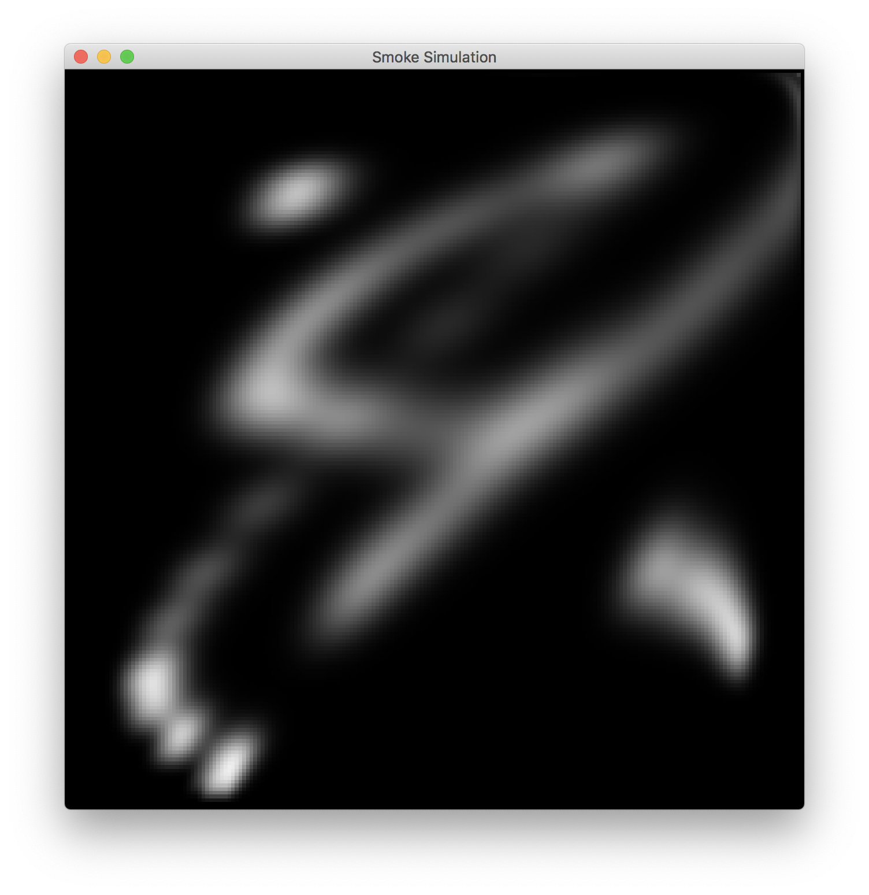

## 
CS 184 Final Project: Smoke Simulation Milestone

### 
Eric Ying, Yuanhao Zhai, Fangzhou Lan

------

### Progression Summary

The functionalities we have accomplished so far include: density advection, velocity advection, viscous diffusion and velocity projection. For the GUI part, we were able to render a 2D grid to simulate the smoke, and we also added mouse input to create smoke.

Currently, we are a little ahead of our planned goals. However, some bugs and edge conditions remain to be solved. We still need to add interaction between the boundary and the smoke.

------

### Preliminary Results

We can launch a 2D grid in which the user can create smoke using mouse dragging. We take simple screenshots to show the result.

------

### Reflection

In our project, the main challenge was solving the incompressible fluid equations. We used this [website ](http://developer.download.nvidia.com/books/HTML/gpugems/gpugems_ch38.html)as a resource for solving these equations. However, in our simulation, the process of solving these equations was also important, because these processes ultimately determined the amount of calculation in our program. Ideally, we want to keep the number of calculations as small as possible to make our simulation fast.

Although our basic simulation is working, we still have a lot of features to add. We need to include temperature into our system. We also need to add interaction between the boundary and the smoke. One additional functionality we want to add is the ability for the user to create their own custom velocity fields.

------

### Updated Work Plan

1. In this week, we are going to finish the rest of the basic simulation, namely adding external force, temperature, taking care of edge conditions, and improving performance and fixing potential bugs.
2. For the next week, we will mainly focus on adding more functionalities to the GUI, like adjusting parameters using keyboard, adding color to the smoke. We also need to start on the final project write up.

------

### Milestone Video and Slide

[Milestone slides](https://docs.google.com/presentation/d/1xc8iehFo53Qi1BeaVvx_Hzys17sqds06qXdil4bO2HM/edit#slide=id.p)

